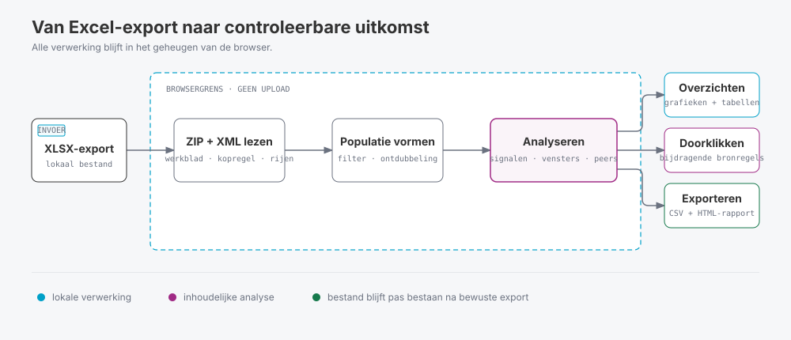

# Ons Escalatielog Audit

Ons Escalatielog Audit is een losse webpagina waarmee je `.xlsx`-exports met escalatielogs uit Nedap Ons controleert. De webui brengt opvallende patronen in beeld en laat per uitkomst de bijbehorende bronregels zien. De webui is bedoeld voor functioneel applicatiebeheerders, CISO's en privacy officers.

De analyse draait volledig in de browser. Het Excelbestand wordt niet geüpload en de webui maakt geen verbinding met externe diensten.

## Zo werkt de analyse

De browser leest het werkblad, verwijdert bekende systeemregels en exacte duplicaten en vormt zo de auditpopulatie. Daarna berekent de webui aggregaties, signalen, tijdvensters en peervergelijkingen. Elk resultaat blijft gekoppeld aan de bronregels die eraan bijdragen.

> [!IMPORTANT]
> Een signaal bewijst niet dat iemand onrechtmatig toegang had of een dossier heeft ingezien. Gebruik de uitkomsten alleen als aanleiding voor menselijke controle.

## Wat doet de webui?

De webui:

- Laat bekende systeemmeldingen en exact dubbele regels buiten de inhoudelijke tellingen.
- Toont overzichten per medewerker, cliënt, locatie, team, deskundigheid, reden en tijdstip.
- Signaleert onder meer her-escalaties, hoge volumes, een brede spreiding over cliënten, nachtgebruik en problemen met de datakwaliteit.
- Vergelijkt patronen met die van vergelijkbare medewerkers, legt de gebruikte peer-ratio's direct bij de tabel uit en zoekt naar korte pieken, cliëntclusters en concentraties.
- Legt controleprioriteit, her-escalaties, geselecteerde tijdvensters, peer-ratio’s en top-3-concentratie uit bij de uitkomst, zowel in de webui als het HTML-rapport. Details tonen gekoppelde tijden; het rapport gebruikt voor her-escalatie een expliciet fictief voorbeeld.
- Koppelt cijfers, grafieken en tabellen aan de bijbehorende Excelregels.
- Exporteert aandachtspunten, bronregels en een zelfstandig HTML-rapport met dezelfde visuele oriëntatie als het webui-overzicht: auditflow, themabalken, tijdpatronen per weekdag en uur, en topgrafieken bij hun tabellen.

In [Berekeningen, tellingen en patroonherkenning](docs/berekeningen-en-patroonherkenning.md) lees je hoe de webui telt, groepeert en patronen herkent.

## Gebruik

Je hoeft niets te installeren en hebt geen webserver nodig.

1. Open `escalatielog-audit-webui.html` in een recente versie van Edge, Chrome, Firefox of Safari (minimaal Edge/Chrome 80, Firefox 113 of Safari 16.4).
2. Kies een `.xlsx`-export of sleep het bestand naar het uploadvak.
3. Klik op **Analyse uitvoeren**.
4. Controleer eerst **Auditlogica** en **Datakwaliteit**.
5. Bekijk daarna **Overzicht** en **Aandachtspunten**.
6. Klik op een cijfer, grafiek of tabelregel om de bronregels te openen.
   Zoek en filter daar op team, deskundigheid, doeltype en auditcontext. **Bronregels CSV** bevat ook bij actieve filters de volledige geopende selectie.
7. Pas zo nodig de instellingen aan en klik op **Analyse opnieuw uitvoeren**.
8. Exporteer de gewenste aandachtspunten, bronregels of het HTML-rapport.

## Vereiste invoer

Gebruik het [Excel-rapport van het escalatielog](https://support.nedap-ons.nl/support/solutions/articles/103000265692-ons-autorisatie-uitgevoerde-escalaties-in-het-escalatielog-bekijken#excel-rapport). De webui verwacht daarin deze 14 kolommen:

- `Gebruiker`
- `Medewerkernummer`
- `Medewerkersteam`
- `Deskundigheid medewerker`
- `Gebruikersnaam`
- `Escalatie reden`
- `Tijdsduur (min.)`
- `Escalatiedoel type`
- `Escalatiedoel naam`
- `Escalatiedoel identificatienummer`
- `Hoofdlocatie cliënt`
- `Gestart op`
- `Geactiveerd op`
- `Bron`

De webui gebruikt het eerste werkblad waarin deze kolommen in een van de eerste tien rijen staan. De webui voegt werkbladen niet samen.

## Uitkomsten beoordelen

Controleer altijd:

1. Of de export de bedoelde periode bevat.
2. Welke systeemregels en duplicaten zijn uitgesloten.
3. Of ontbrekende of ongeldige waarden de uitkomst beïnvloeden.
4. Of de ingestelde drempels bij je eigen omgeving passen.
5. Welke bronregels bij een signaal horen.
6. Of de planning, het rooster, de autorisatie of de dossierlogging het patroon verklaart.

Niet alle schermen gebruiken dezelfde regels. **Datakwaliteit** kijkt bijvoorbeeld ook naar duplicaten. De inhoudelijke tellingen tellen die niet dubbel mee. Eén regel kan meerdere signalen hebben, maar telt bij **Aandachtspunten** maar één keer. De precieze definities staan in de [technische documentatie](docs/berekeningen-en-patroonherkenning.md).

## Privacy

De webui verwerkt de export alleen in het geheugen van de browser. Als je de pagina sluit of vernieuwt, worden de ingelezen gegevens gewist. Gedownloade CSV- en HTML-bestanden blijven wel op het apparaat staan en kunnen persoonsgegevens bevatten. Bewaar en deel deze bestanden volgens de interne afspraken van je organisatie.

## Licentie

Dit project valt onder de [MIT-licentie](LICENSE).
