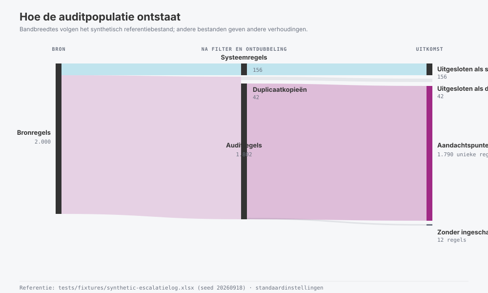
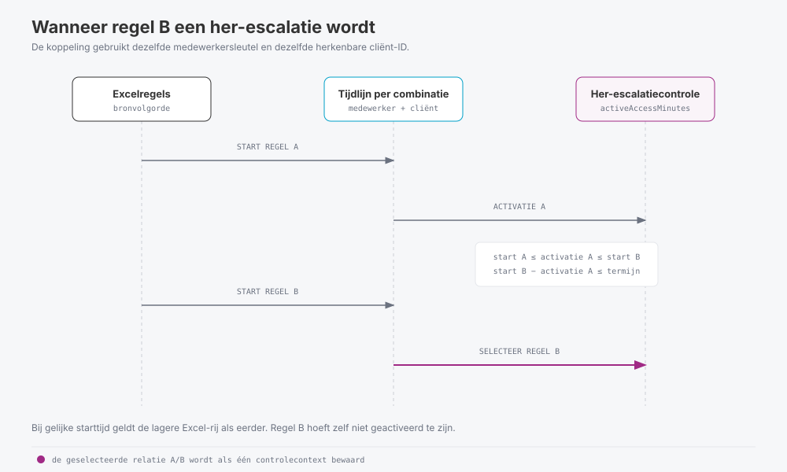
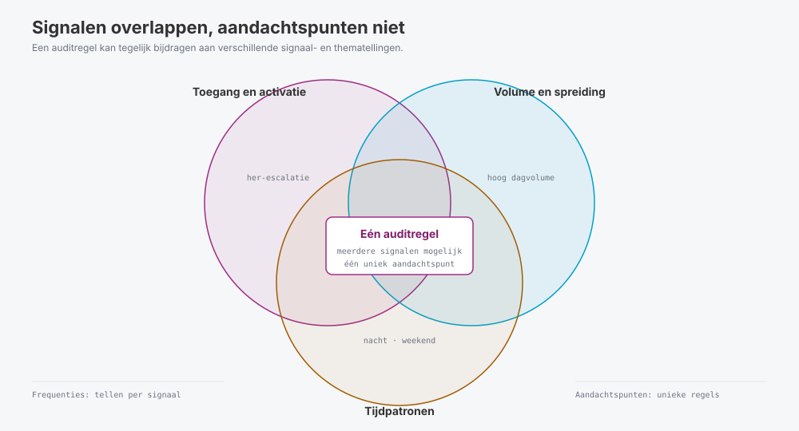
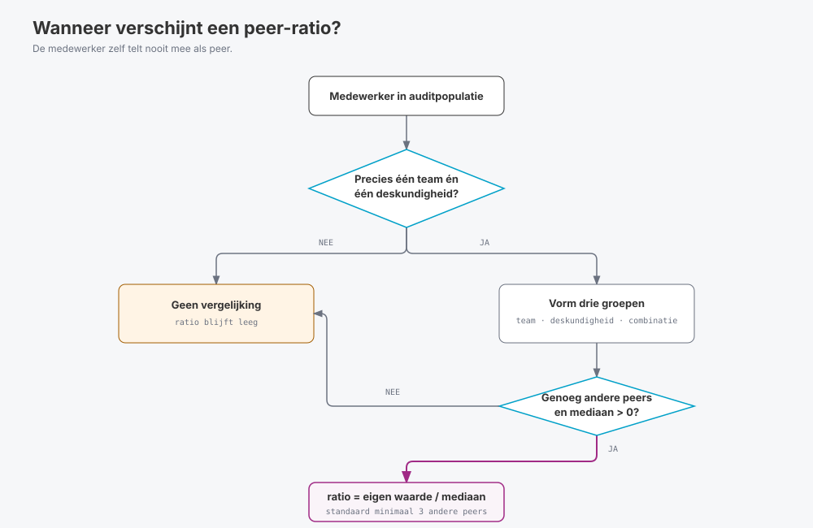
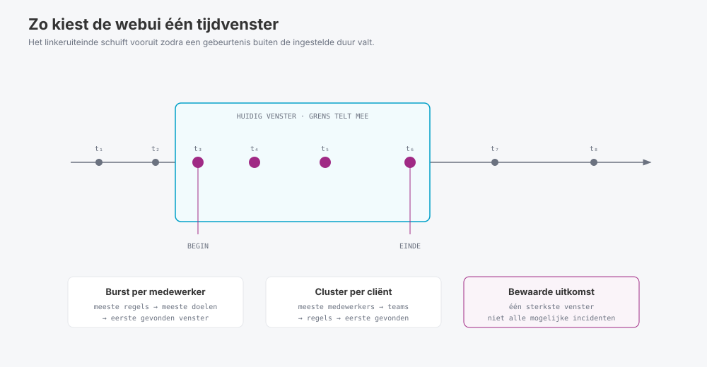

## Berekeningen, tellingen en patroonherkenning

Dit document legt de berekeningen in `escalatielog-audit-webui.html` technisch en functioneel uit. Per analyse staat er welke regels meetellen, hoe de webui sleutels en unieke waarden bepaalt en welke teller en noemer bij een uitkomst horen. Ook de verwerking van grenswaarden, tijdvensters en gelijkstanden komt aan bod.

De HTML-code bepaalt hoe de webui zich gedraagt. Wijkt dit document daarvan af, dan geldt de implementatie. Werk in dat geval de uitleg bij.

Een escalatieregel legt een poging of gebeurtenis rond uitzonderlijke toegang vast. Een geregistreerde activatie bewijst niet dat iemand daarna dossiergegevens heeft bekeken. Een auditsignaal wijst alleen een regel aan die controle nodig heeft; het bewijst geen onrechtmatige toegang.

## 1. Reikwijdte

De webui verwerkt per analyse één Excelbestand. In de eerste tien rijen zoekt het naar een rij met alle vereiste kolomkoppen en kiest het eerste passende werkblad. Het voegt werkbladen niet samen. De berekeningen gaan uit van de ingelezen export en de instellingen van de laatste analyse.

Zoeken, sorteren en filteren verandert alleen wat de tabel laat zien. De analysepopulatie, aggregaties, grafieken en exports blijven gelijk.

Deze referentie legt het gedrag van de huidige implementatie uit. Ze bevestigt geen leveranciersspecificaties, wettelijke verplichtingen of volledige naleving van normen. Controleer daarom eerst de inrichting en beschikbare logging van Nedap Ons voordat je de uitkomsten inhoudelijk beoordeelt.

De ingebouwde XLSX-lezer is gemaakt voor een Nedap Ons-export met één werkblad en tekst- of getalcellen. De lezer ondersteunt geen foutcellen (`#N/A` en vergelijkbaar), fonetische tekst in gedeelde tekenreeksen of ZIP64-bestanden. Voor de webui is een browser met `DecompressionStream` nodig: Edge/Chrome 80+, Firefox 113+ of Safari 16.4+.

## 2. Technische uitgangspunten

De populatie waarop een getal is gebaseerd, is onderdeel van de definitie:

- **Inhoudelijke analyses:** gebruiken `auditRows`, dus niet-systeemregels na exacte ontdubbeling.
- **Datakwaliteit:** gebruikt `manualRows`, dus niet-systeemregels vóór ontdubbeling. Daardoor blijven duplicaten als kwaliteitsbevinding zichtbaar.
- **Auditlogica:** gebruikt `allRows`, dus alle geïmporteerde niet-lege bronregels, inclusief later uitgesloten systeemregels en duplicaten.
- **Ontbrekende sleutels:** verwijderen een regel niet automatisch uit `auditRows`. De regel kan wel ontbreken in een aggregatie waarvoor die sleutel vereist is.
- **Signaalfrequenties:** tellen regels per signaal en mogen overlappen. Eén regel met drie signalen draagt aan drie signaalfrequenties bij.
- **Aandachtspunten:** tellen unieke auditregels met ten minste één ingeschakeld signaal. Dezelfde regel telt hier altijd eenmaal.

De tabellen voor medewerkers, cliënten, locaties, teams, deskundigheden en redenen tonen samengevoegde resultaten. Als je op een regel klikt, zie je alle auditregels die aan die groep bijdragen. De selectie beperkt zich dus niet tot de waarde in één kolom.

## 3. Invoervelden en hun gebruik

De webui verwacht de onderstaande 14 kolomnamen. Het zoekt in de eerste tien rijen naar een werkblad met deze kopregel en kiest het eerste passende werkblad. Het voegt meerdere werkbladen niet samen.

| Kolom | Gebruik | Beperking |
| -- | -- | -- |
| `Gebruiker` | Weergavenaam en laatste terugval voor medewerkeridentificatie | Namen kunnen wijzigen of bij meerdere personen voorkomen |
| `Medewerkernummer` | Eerste keuze voor de medewerkersleutel | Niet zelf corrigeren of samenvoegen zonder verificatie |
| `Medewerkersteam` | Teamtelling en context voor peers | Is de geregistreerde teamwaarde; bewijst geen behandelrelatie |
| `Deskundigheid medewerker` | Functiegroepen en peercontext | Geen maat voor inzet, bevoegdheid of caseload |
| `Gebruikersnaam` | Tweede keuze voor medewerkeridentificatie en conflictcontrole | Eén account kan in de export aan meerdere nummers zijn gekoppeld |
| `Escalatie reden` | Systeemfilter, redenverdeling en signalen | Opgegeven tekst verklaart niet zelfstandig de noodzaak |
| `Tijdsduur (min.)` | Duurverdeling, datakwaliteit en optioneel duurfilter | Wordt niet gebruikt als toegangstermijn voor her-escalaties |
| `Escalatiedoel type` | Onderscheid tussen cliënt- en locatiedoelen | Onbekende typen vragen controle |
| `Escalatiedoel naam` | Leesbare weergave en volledigheidscontrole | Wordt niet gebruikt als cliënt- of locatiesleutel |
| `Escalatiedoel identificatienummer` | Sleutel voor cliënt- of locatieanalyse | Ontbrekend ID verhindert analyse van dat specifieke doel |
| `Hoofdlocatie cliënt` | Aanvullende context bij cliënten | Geen bewijs van de locatie tijdens de escalatie of van teamtoegang |
| `Gestart op` | Kalenderdag, uur, volgorde, bursts en her-escalaties | Tijdzone en volledigheid van de export zijn niet vastgelegd in deze velden |
| `Geactiveerd op` | Activatievertraging en eerdere activatie als her-escalatiecontext | `Niet geactiveerd`, ontbrekend en ongeldig zijn verschillende toestanden |
| `Bron` | Technische controle en bronregeldetail | In het referentiebestand alleen `Synthetische generator`; maakt daarom geen onderscheid in de analyse |

### 3.1 Sleutels en normalisatie

Voor de medewerkersleutel gebruikt de webui de eerste beschikbare waarde uit `Medewerkernummer`, `Gebruikersnaam` en `Gebruiker`. Een lege waarde of `-` telt als ontbrekend. Ontbreken ze alle drie, dan blijft de regel in de auditpopulatie staan maar verschijnt hij niet in het medewerkersoverzicht. Koppelen op naam is minder betrouwbaar. De webui meldt conflicten tussen identifiers, maar lost ze niet automatisch op.

De webui groepeert cliënten op doel-ID bij doeltype `Cliënt` en locaties op doel-ID bij doeltype `Locatie`. Bij gemengde doelen bestaat de sleutel uit het doeltype en het doel-ID. Een cliënt en een locatie met hetzelfde nummer blijven zo twee verschillende doelen.

De webui verwijdert witruimte aan het begin en einde van tekstwaarden. Voor groepering en systeemherkenning zet het escalatieredenen ook om in kleine letters en vervangt het opeenvolgende spaties door één spatie. Synoniemen en inhoudelijk vergelijkbare redenen blijven aparte groepen. Voor teams en deskundigheden geldt deze normalisatie niet, waardoor schrijfvarianten daar los van elkaar kunnen blijven staan.

In samenvattingen toont de webui vaak de meest voorkomende naam, teamwaarde of deskundigheid. Dat is alleen een keuze voor de weergave en zegt niets over de actuele organisatorische indeling. Bij bursts en concentratie komen team en deskundigheid uit de eerste bijbehorende regel. Controleer de bronregels als de context wisselt.

### 3.2 Ontbrekende cliëntgegevens

Een cliëntgerichte regel zonder doel-ID telt wel mee in de auditpopulatie en, waar mogelijk, in medewerker-, team-, reden- en tijdanalyses. Deze regel telt niet mee bij unieke cliënten, cliëntspecifieke signalen, cliëntclusters of her-escalaties voor dezelfde cliënt. Een ontbrekende cliëntnaam met een aanwezig ID verhindert groepering niet, maar geeft wel een volledigheidssignaal.

Het referentiebestand bevat 1.611 cliëntgerichte auditregels: 1.554 met herkenbaar cliënt-ID en 57 zonder herkenbaar cliënt-ID. Van de 310 niet-geactiveerde regels zijn er 7 cliëntgericht zonder herkenbaar doel-ID. Dat verband is een bevinding uit dit bestand en geen algemene regel voor toekomstige exports.

## 4. Van bronbestand naar auditpopulatie

| Verzameling | Definitie |
| -- | -- |
| `allRows` | Niet-lege gegevensrijen onder de gevonden kopregel |
| `systemRows` | Regels die voldoen aan het toegepaste systeemfilter |
| `manualRows` | Alle overige regels, nog vóór ontdubbeling |
| `duplicateRows` | Extra exemplaren van gelijke regels binnen `manualRows` |
| `auditRows` | `manualRows` na ontdubbeling; basis voor inhoudelijke analyses |
| `attention` | Auditregels met minimaal één ingeschakeld signaal |

De naam `manualRows` betekent hier dat het systeemfilter de regel niet heeft herkend. Een onbekende nieuwe systeemreden kan dus voorlopig in deze verzameling terechtkomen.



Het diagram gebruikt het synthetisch referentiebestand als voorbeeld. De bandbreedtes en aantallen gelden alleen voor dat referentiebestand; de verzamelingen en rekenregels gelden voor iedere analyse.

De aantallen moeten aansluiten volgens:

```text
bronregels = systeemregels + duplicaatkopieën + auditregels
auditregels = regels met minimaal één signaal + regels zonder ingeschakeld signaal
```

De webui slaat volledig lege rijen over. Andere instructie- of totaalrijen verwijdert het niet automatisch. Gebruik daarom een export met echte logregels onder de kolomkoppen.

### 4.1 Systeemfilter

De webui sluit een regel uit als de genormaliseerde reden precies overeenkomt met een van deze teksten:

```text
Cliënt gekoppeld aan item in Ons Ketenverkeer
Systeemescalatie: sta 30 minuten toegang toe tot cliënt na aanmaken.
Toegang tot cliënt nadat deze is aangemaakt door Ons Ketenverkeer
```

De duur speelt bij deze herkenning geen rol. Met `excludeDuration30` kun je daarnaast alle regels uitsluiten waarvan de numerieke duur 30 minuten is. Deze optie staat standaard **uit**. Een onbekende reden met een duur van 30 minuten blijft daarom normaal in de auditpopulatie staan en verschijnt als controlepunt in **Auditlogica**.

Controleer na wijzigingen in de export of applicatie opnieuw de verdeling van redenen en duur. Het referentiebestand bevat 156 herkende systeemregels: 44 voor de eerste reden, 51 voor de tweede en 61 voor de derde. Al deze regels duren 30 minuten. In de auditpopulatie staan daarnaast 337 handmatige regels met een duur van precies 30 minuten. Het aanvullende duurfilter sluit bij dit bestand dus extra regels uit; zet het aan en uit om het verschil te zien.

### 4.2 Duplicaten

De webui vergelijkt bij alle niet-uitgesloten regels de 14 bronvelden nadat ze zijn ingelezen en de witruimte aan begin en einde is verwijderd. Zijn de waarden gelijk, dan blijft het eerste exemplaar in de auditpopulatie staan. Latere exemplaren vallen af en verwijzen naar de oorspronkelijke Excel-rij.

De vergelijking kijkt naar de ingelezen veldwaarden, niet naar de bytes van het bestand. Omdat een uniek gebeurtenis-ID ontbreekt, kan de webui twee verder identieke gebeurtenissen niet van elkaar onderscheiden. Ontdubbeling is dus een bewuste analysekeuze. Beoordeel die keuze opnieuw als de definitie van de export verandert.

De webui zet systeemregels al voor deze stap apart en ontdubbelt die niet. Het aantal systeemregels is daarom gelijk aan het aantal uitgesloten bronregels. Een duplicaatgroep kan bij **Datakwaliteit** drie exemplaren bevatten, terwijl **Duplicaten** in de auditflow twee uitgesloten kopieën telt.

### 4.3 Datakwaliteit heeft een andere basis

De inhoudelijke tellingen gebruiken `auditRows`. **Datakwaliteit** bekijkt de niet-uitgesloten regels vóór ontdubbeling, zodat duplicaten zichtbaar blijven. **Auditlogica** controleert alle bronregels op duur, reden, doeltype en bronwaarde. De tabbladen gebruiken dus verschillende populaties. Je kunt hun aantallen niet zomaar vergelijken of bij elkaar optellen.

## 5. Kerncijfers, tellers en noemers

| Maat | Berekening | Interpretatie |
| -- | -- | -- |
| Auditpopulatie | Aantal `auditRows` | Resterende unieke logregels, inclusief niet-geactiveerde pogingen |
| Auditpopulatie als percentage | `100 × auditregels / bronregels` | Houdt rekening met systeemregels én duplicaatkopieën |
| Aandachtspunten | Unieke auditregels met minimaal één ingeschakeld signaal | Eén regel telt eenmaal, ook bij meerdere signalen |
| Aandachtspunten als percentage | `100 × aandachtspunten / auditregels` | Omvang van de controleselectie, geen percentage overtredingen |
| Medewerkers | Verschillende beschikbare medewerkersleutels in de auditpopulatie | Geen personeelsbestand en geen volledige teambezetting |
| Cliënten | Verschillende herkenbare doel-ID's bij cliëntgerichte auditregels | Pogingen zonder cliënt-ID tellen niet mee |
| Niet geactiveerd | Regels met de tekst `Niet geactiveerd` in het activatieveld | Ontbrekende of ongeldige activatietekst telt hier niet automatisch mee |
| Niet geactiveerd als percentage | `100 × expliciet niet-geactiveerde auditregels / auditregels` | Het totaal omvat cliënt- en locatieregels |
| Signaalfrequentie | Aantal auditregels waarop één specifiek signaal staat | Frequenties van verschillende signalen kunnen overlappen |
| Regels per controlethema | Unieke auditregels met minimaal één signaal binnen dat thema | Binnen een thema eenmaal tellen; tussen thema's is overlap mogelijk |

De webui leidt de totalen voor her-escalaties en zeer snelle her-escalaties af uit de berekende intervallen. De bijbehorende schakelaars bepalen alleen of deze regels ook onder **Aandachtspunten** vallen. Als je een signaal uitschakelt, kan het beschrijvende aantal dus nog steeds in een overzicht staan.

De meeste percentages krijgen één decimaal; peer-ratio's krijgen er twee. Algemene percentagefuncties tonen bij een lege populatie `0%`. Dat betekent dat de basis leeg is, niet dat het verschijnsel aantoonbaar niet voorkwam. Een peer-ratio blijft leeg bij te weinig vergelijkingsmateriaal of een mediaan van nul.

## 6. Basisanalyses en vergelijkbaarheid

### 6.1 Medewerkers

Per medewerkersleutel telt de webui de auditregels, unieke herkenbare cliënten en locaties, redenen, actieve dagen en het hoogste dagvolume. Ook toont het niet-geactiveerde pogingen, nacht- en weekendregels, berekende her-escalaties, regels met signalen en het eerste en laatste geldige starttijdstip.

Een actieve dag is een kalenderdag met minimaal één auditregel met geldige startdatum. Het is geen gewerkte dag of dienst. Een medewerker kan in deze tabel over meerdere teams of deskundigheden zijn samengevat; de peeranalyse stelt daarom aanvullende voorwaarden.

### 6.2 Cliënten en locaties

Deze tabellen groeperen auditregels op doeltype en doel-ID. Ze tonen het volume en de spreiding over medewerkers, teams, deskundigheden en redenen. Niet-geactiveerde pogingen met een herkenbaar doel tellen mee.

Het aantal verschillende medewerkers rond een cliënt is het aantal geregistreerde medewerkers met een escalatiepoging. Het is geen telling van medewerkers die aantoonbaar het dossier hebben ingezien. De kolom `Hoofdlocatie` bij een cliënt is context; het tabblad **Locaties** gaat over escalaties met doeltype `Locatie`.

### 6.3 Teams en deskundigheden

De webui wijst iedere bronregel toe aan het team en de deskundigheid die in die regel staan. Komt een medewerker bij verschillende teams voor, dan kan die persoon in meerdere teamgroepen meetellen. Tel unieke aantallen uit verschillende groepen niet bij elkaar op tot een organisatietotaal.

```text
escalaties per waargenomen medewerker =
  aantal auditregels van de groep / aantal herkenbare medewerkers in die groep
```

In de noemer staan alleen medewerkers uit de auditpopulatie. Medewerkers zonder escalaties ontbreken, net als gegevens over FTE, gewerkte uren, diensten en caseload. De maat corrigeert daarom niet voor de volledige teamomvang of werklast. Als medewerkersleutels ontbreken, kan de teller regels bevatten van medewerkers die niet in de noemer staan. Technisch gebruikt de implementatie minimaal 1 als deler. Zijn er geen herkenbare medewerkers, dan is de getoonde uitkomst geen bruikbaar gemiddelde.

Het nachtpercentage per deskundigheid is het aantal nachtregels gedeeld door alle auditregels van die deskundigheid. Regels met een ongeldige startdatum blijven in de noemer staan, maar de webui kan ze niet als nachtregel herkennen. Controleer dus eerst de datakwaliteit voordat je percentages tussen groepen vergelijkt.

### 6.4 Redenen

Na normalisatie groepeert de webui dezelfde redenen. De tabel toont aantallen, schrijfvarianten, betrokken medewerkers, cliënten en teams, niet-geactiveerde pogingen en regels met signalen. De meest voorkomende duur is alleen een beschrijvende waarde. De webui leidt er geen geldigheidsduur van de toegang uit af.

Ontbrekende waarden kunnen als lege categorie verschijnen. Tellingen van unieke redenen in de verschillende samenvattingen behandelen ontbrekende waarden niet overal hetzelfde. Gebruik het tabblad **Redenen** en de bronregels voor een vergelijking waarbij ontbrekende redenen relevant zijn.

### 6.5 Tijdpatronen

De webui telt geldige starttijdstippen per datum, uur en weekdag. De heatmap combineert weekdag en uur; deze gecombineerde telling hoort bij het analyseresultaat, zodat de webui-heatmap en de weekdag/uur-matrix in het HTML-rapport dezelfde waarden gebruiken. Ongeldige startdatums blijven in de auditpopulatie maar vallen buiten tijdgebonden berekeningen; het rapport vermeldt dit aantal apart en de som van alle matrixcellen plus dit aantal is de auditpopulatie.

De grafieken tonen ruwe volumes. Ze houden geen rekening met het aantal maandagen of zondagen in het bestand, de bezetting van diensten of ontbrekende exportdagen. Het datumoverzicht bevat alleen dagen waarop geldige auditregels voorkomen. Ontbreekt een datum, dan bewijst dat niet dat er die dag geen activiteit was.

Het getoonde datumbereik loopt van het eerste tot het laatste geldige starttijdstip dat de webui vindt. Op het overzicht komt dit bereik uit de auditpopulatie; voor exportnamen en het rapport gebruikt de webui de bronpopulatie. De bereiken kunnen verschillen als op de eerste of laatste dagen alleen systeemregels staan. Geen van beide bereiken bewijst dat de bedoelde exportperiode volledig aanwezig is.

## 7. Tijdstippen en toegangstermijn

De parser kan overweg met numerieke Excel-datums in het 1900-datumsysteem, datumtijdtekst zoals `01-05-2026, 09:30:00` en de ondersteunde ISO-vorm zonder tijdzone. Onmogelijke kalenderdatums en kloktijden wijst hij af. Een datum zonder tijd, zoals `01-05-2026`, herkent hij niet en telt daarom als ongeldige startdatum. Bij een bestand met het 1904-datumsysteem verschijnt een foutmelding.

De webui behandelt tijdstippen als de kloktijden uit de export, los van de tijdzone van de browser. Het stelt de tijdzone van de bron niet vast en rekent tijden niet om. Daardoor zijn tijdverschillen rond de overgang tussen zomer- en wintertijd onzeker. Gebeurtenissen van vóór het begin van de export zijn evenmin bekend.

In het referentiebestand lopen de voorkomende tijdsduren van 15 tot en met 840 minuten (15: 388, 30: 337, 60: 345, 120: 349 en 840: 383 regels). Voor her-escalaties gebruikt de webui daarnaast `activeAccessMinutes = 840`. Die 14 uur is een overgenomen functionele aanname voor triage. De export bevestigt deze termijn niet en laat ook niet zien of toegang tussentijds is ingetrokken.

Laat FAB controleren of de gebruikte toegangstermijn overeenkomt met de inrichting. Een verkeerde termijn verandert welke her-escalaties de webui selecteert. Bewaar daarom bij iedere beoordeling de toegepaste instellingen.

## 8. Her-escalaties en activatievertraging

### 8.1 Her-escalatie tijdens aangenomen actieve toegang

Voor een nieuwe regel B zoekt de webui binnen de auditpopulatie naar een eerdere regel A van dezelfde medewerkersleutel en dezelfde herkenbare cliënt-ID. Beide starttijdstippen moeten geldig zijn. Regel A moet een leesbare activatie hebben die niet vóór de eigen start ligt.



De tijdsvoorwaarden zijn:

```text
start A <= start B
start A <= activatie A <= start B
0 <= start B - activatie A <= activeAccessMinutes
```

De grenzen tellen mee. Hebben twee regels dezelfde starttijd, dan behandelt de webui de lagere Excel-rij als de eerdere regel. Zo levert dezelfde invoer steeds dezelfde uitkomst op, maar dit bewijst geen werkelijke volgorde binnen die seconde. Regel B hoeft zelf niet geactiveerd te zijn.

De webui gebruikt de meest recente beschikbare activatie van de passende eerdere regels. Een eerdere poging die pas na de start van B activeert, verdringt een activatie die op dat moment al beschikbaar was niet. Bij het aandachtspunt bewaart de webui de geselecteerde eerdere bronrij en toont die bij doorklikken.

Zonder cliënt-ID, medewerkersleutel of startdatum kan de webui de regels niet koppelen. Een activatie vóór de eigen start geldt bij deze controle niet als geldige eerdere activatie.

### 8.2 Zeer snelle her-escalatie

Dit is een aanvullend kenmerk van dezelfde geselecteerde relatie A/B:

```text
her-escalatie volgens paragraaf 8.1
en 0 <= start B - start A <= veryFastRepeatMinutes
```

De standaard is 5 minuten. Deze maat vergelijkt dus met de eerdere regel die voor de actieve-toegangscontrole is gekozen, niet met iedere willekeurige vorige poging. Een reeks niet-geactiveerde pogingen zonder geldige eerdere activatie krijgt op deze grond geen zeer-snel-signaal.

### 8.3 Activatievertraging

```text
activatievertraging in minuten = (activatie - start) / 60 seconden
late activatie als activatievertraging > activationDelayThresholdMinutes
```

De standaardgrens ligt strikt boven 2 minuten. De webui beoordeelt het ongeronde tijdsverschil, terwijl de tabel een afgeronde waarde toont. Precies 2 minuten telt daarom niet als late activatie; 2 minuten en 1 seconde wel.

Een negatieve vertraging krijgt een datakwaliteitssignaal. Dat geldt ook voor een lege of onleesbare activatie, behalve als het veld letterlijk `Niet geactiveerd` bevat. Dit is een aparte geregistreerde toestand. Uit de tekst blijkt niet wat de oorzaak was.

## 9. Auditsignalen

De onderstaande criteria gelden voor auditregels en de toegepaste instellingen. Drempels selecteren patronen; het zijn geen normen voor toelaatbaar gedrag.

| Signaal | Standaardcriterium | Welke regels krijgen het signaal? |
| -- | -- | -- |
| `NIET_GEACTIVEERD` | Aan | Regels met expliciet `Niet geactiveerd` |
| `NACHT` | Aan; 23:00 tot 06:00 | Startuur ≥ 23 of < 6; begin inclusief, einde exclusief |
| `WEEKEND` | Uit | Bij inschakelen: zaterdag of zondag |
| `HOOG_DAGVOLUME` | ≥ 15 | Alle regels van de medewerker op die kalenderdag |
| `VEEL_UNIEKE_CLIENTEN_MEDEWERKER` | ≥ 50 herkenbare cliënten | Alle auditregels van de medewerker in de export, ook diens locatieregels |
| `VEEL_MEDEWERKERS_CLIENT` | ≥ 4 herkenbare medewerkers | Alle auditregels voor die herkenbare cliënt |
| `VEEL_TEAMS_CLIENT` | ≥ 3 niet-lege teams | Alle auditregels voor die herkenbare cliënt |
| `HERESCALATIE_TIJDENS_ACTIEVE_TOEGANG` | Aan; ≤ 840 minuten | De nieuwe regel die aan paragraaf 8.1 voldoet |
| `ZEER_SNELLE_HERESCALATIE` | Aan; ≤ 5 minuten | De nieuwe regel die aan paragraaf 8.2 voldoet |
| `LATE_ACTIVATIE` | Aan; > 2 minuten | De vertraagd geactiveerde regel |
| `ZELDZAME_REDEN` | Uit; ≤ 2 keer | Bij inschakelen: regels met een reden die maximaal zo vaak in de auditpopulatie voorkomt |
| `ONGELDIGE_STARTDATUM` | Datakwaliteit aan | Start ontbreekt of de webui kan deze niet lezen |
| `ONTBREKENDE_KERNVELDEN` | Datakwaliteit aan | Gebruiker, medewerkernummer, team of reden ontbreekt |
| `ONVOLLEDIG_CLIENTDOEL` | Datakwaliteit aan | Cliëntdoel mist cliënt-ID of cliëntnaam |
| `ONGELDIGE_ACTIVATIE` | Datakwaliteit aan | Activatie ontbreekt, is onleesbaar of ligt vóór de start; expliciet niet-geactiveerde regels uitgezonderd |
| `ONGELDIGE_DUUR` | Datakwaliteit aan | Duur ontbreekt, is niet numeriek of is negatief |

Eén groepssignaal kan op veel regels staan. Honderd regels met `HOOG_DAGVOLUME` betekenen bijvoorbeeld niet dat er honderd verschillende piekdagen waren. De drempels voor cliënten en medewerkers gelden voor het hele bestand. De lengte van de exportperiode beïnvloedt deze signalen dus.

Als begin- en einduur gelijk zijn, is het nachtvenster leeg. De opgetelde nacht- en weekendtellingen blijven wel beschikbaar wanneer je het bijbehorende signaal uitschakelt.

## 10. Controleprioriteit en overlap

De webui groepeert signalen in vier thema's:

| Thema | Signalen |
| -- | -- |
| Toegang en activatie | Her-escalatie, zeer snelle her-escalatie, niet geactiveerd, late activatie |
| Volume en spreiding | Hoog dagvolume, veel cliënten per medewerker, veel medewerkers of teams per cliënt, zeldzame reden |
| Tijdpatronen | Nacht en weekend |
| Datakwaliteit | Ontbrekende kernvelden of cliëntgegevens, ongeldige start, activatie of duur |



Het diagram toont drie van de vier thema's om de overlap leesbaar te houden. Ook datakwaliteit kan met deze thema's op dezelfde auditregel voorkomen. Signaal- en thematellingen mogen die regel ieder tellen, maar bij **Aandachtspunten** telt hij eenmaal.

De webui bepaalt de controleprioriteit alleen voor aandachtspunten:

| Prioriteit | Regel |
| -- | -- |
| Hoog | Het ingeschakelde her-escalatiesignaal is aanwezig, of er zijn signalen uit minimaal drie thema's |
| Midden | Twee thema's, zonder de bovenstaande hoge prioriteit |
| Basis | Overige aandachtspunten |

Bij een niet-geactiveerde poging telt `ONVOLLEDIG_CLIENTDOEL` niet nogmaals mee voor het aantal prioriteitsthema's. Het signaal blijft wel zichtbaar en telt mee in de datakwaliteitsthemakaart. Je kunt de aantallen uit de themakaarten en prioriteitsgroepen daarom niet rechtstreeks bij elkaar optellen.

Deze indeling bepaalt alleen de werkvolgorde. Het is niet aangetoond dat de thema's onafhankelijk van elkaar zijn. Ook zeggen de labels niets over de ernst van een mogelijke overtreding of de kans daarop. De aandachtspuntentabel sorteert eerst op prioriteit, dan op het aantal signalen en tot slot op starttijd.

In het referentiebestand is er sprake van gedeeltelijke overlap: `ONVOLLEDIG_CLIENTDOEL` staat op dezelfde 57 regels zonder herkenbaar doel-ID, waarvan 7 ook `NIET_GEACTIVEERD` hebben. Deze regels zijn samen 57 unieke regels, geen 114 losse bevindingen. Ook een zeer snelle her-escalatie en een her-escalatie kunnen hetzelfde patroon beschrijven.

## 11. Verdiepende analyses

### 11.1 Peervergelijking

De webui kan een medewerker vergelijken als alle bijbehorende auditregels precies één ingevuld team en één ingevulde deskundigheid bevatten. Wisselt deze context of ontbreekt er een waarde, dan krijgt de medewerker geen peer-ratio en telt die ook niet mee als peer van anderen.

Voor iedere vergelijkbare medewerker maakt de webui drie groepen met andere vergelijkbare medewerkers:

1. hetzelfde team;
2. dezelfde deskundigheid;
3. hetzelfde team én dezelfde deskundigheid.

De medewerker zelf telt niet mee in deze groepen. Per groep zijn standaard minimaal drie **andere** medewerkers nodig. Na het sorteren is de mediaan het middelste persoonsaantal. Bij een even aantal peers neemt de webui het gemiddelde van de twee middelste waarden.



| Getoonde ratio | Teller | Noemer |
| -- | -- | -- |
| Volume / team | Auditregels medewerker | Mediaan auditregels van andere vergelijkbare teamleden |
| Cliënten / team | Unieke herkenbare cliënten medewerker | Mediaan unieke cliënten van andere vergelijkbare teamleden |
| Volume / deskundigheid | Auditregels medewerker | Mediaan auditregels van andere vergelijkbare medewerkers met die deskundigheid |
| Volume / team+deskundigheid | Auditregels medewerker | Mediaan auditregels van andere vergelijkbare medewerkers met die combinatie |

De ratio blijft leeg als er te weinig peers zijn of als de noemer nul is. Een ratio van 2 betekent dat de uitkomst binnen deze export tweemaal zo hoog is als de groepsmediaan. Het betekent niet dat de werklast of het risico tweemaal zo hoog is.

Voorbeeld: medewerker A heeft 20 regels. Drie andere passende medewerkers hebben er 4, 10 en 16. De mediaan van deze peers is 10 en de ratio van A is `20 / 10 = 2,00`. Zijn er maar twee passende anderen, dan blijft de ratio met de standaardinstelling leeg.

Medewerkers zonder auditregels zijn niet zichtbaar. De vergelijking selecteert dus op escalatiegebruik en corrigeert niet voor diensten, FTE, inzetduur, caseload of verschillen in autorisatie. Voor het nachtpercentage en het aantal cliënten per deskundigheid berekent de webui geen peer-ratio.

Bij doorklikken zie je de bronregels van de medewerker en alle gebruikte team- en deskundigheidspeers. De combinatiegroep is de overlap tussen deze groepen. Daardoor bevat het venster met bronregels meer regels dan alleen de teller van één ratio.

De webui en het HTML-rapport tonen deze formule, de vier teller-noemercombinaties, een rekenvoorbeeld en de betekenis van `0,50`, `1,00` en `2,00` direct bij de peeranalysetabel. In het rapport valt de uitleg binnen dezelfde inklapbare sectie als de tabel. De beperkingen blijven daar eveneens zichtbaar. Het doorklikvenster heet **Bronregels achter peeranalyse** en dient om de onderliggende regels te controleren; de ratio-uitleg staat bij de tabel zelf.

### 11.2 Bursts per medewerker

Een burst is een groot aantal pogingen van één medewerker binnen een voortschrijdend tijdvenster. Alleen regels met een medewerkersleutel en een geldige starttijd tellen mee. Alle doeltypen kunnen bijdragen. Een onbekend doel-ID telt wel als poging, maar niet als herkenbaar uniek doel.

Het standaardvenster is 60 minuten en de drempel is 5 regels. Ook gebeurtenissen precies op de tijdsgrens tellen mee. De webui toont per medewerker één venster. Het kiest eerst het venster met de meeste regels en bij een gelijke stand het venster met de meeste verschillende herkenbare doelen. Is ook dat gelijk, dan blijft het eerst gevonden venster staan.

De getoonde begin- en eindtijd horen bij de eerste en laatste gebeurtenis in het venster. Het verschil kan korter zijn dan 60 minuten. De tabel telt medewerkers met een geselecteerd venster, niet het aantal losse incidenten of alle mogelijke bursts.

### 11.3 Cliëntclusters

Deze analyse gebruikt cliëntgerichte auditregels met een herkenbaar cliënt-ID en een geldige starttijd. De webui zoekt per cliënt in vensters van standaard 120 minuten. Een venster voldoet aan de drempel bij minimaal 3 herkenbare medewerkers **of** minimaal 2 ingevulde teams.

Uit de passende vensters kiest de webui per cliënt het sterkste. Eerst kijkt het naar het aantal medewerkers, daarna naar het aantal teams en tot slot naar het aantal regels. Blijft de stand gelijk, dan blijft het eerst gevonden venster staan. Een venster dat alleen de teamdrempel haalt, blijft zo beschikbaar.

Voorbeeld bij een medewerkersdrempel van 4: een ochtendvenster met 3 medewerkers uit 1 team voldoet niet. Een middagvenster met 2 medewerkers uit 2 teams voldoet wel aan de teamdrempel van 2 en verschijnt daarom in de tabel.

Dit patroon bewijst niet dat medewerkers buiten hun werkgebied handelden. Het kan bijvoorbeeld samenhangen met acute zorg, een opname, een overdracht of tijdelijke inzet. De webui toont ook hier maar één geselecteerd venster, niet alle clusters in het bestand.



Hetzelfde schuivende-vensterprincipe ondersteunt beide analyses. De rangschikking bij een gelijke stand verschilt: een burst kijkt na het aantal regels naar verschillende doelen, terwijl een cliëntcluster achtereenvolgens medewerkers, teams en regels vergelijkt.

### 11.4 Concentratie per medewerker

```text
top-3 doelaandeel =
  100 × regels naar de drie meest voorkomende herkenbare doelen
      / alle regels van de medewerker met een herkenbaar doel

top-3 cliëntaandeel =
  100 × regels naar de drie meest voorkomende herkenbare cliënten
      / alle cliëntgerichte regels van de medewerker met herkenbaar cliënt-ID
```

Gemengde doelen gebruiken doeltype plus doel-ID; het cliëntaandeel gebruikt alleen cliënt-ID's. Een lege noemer geeft een lege cel. Pogingen zonder herkenbaar doel tellen niet mee in teller of noemer, maar blijven in het totale escalatievolume staan.

Bij drie of minder herkenbare doelen is het top-3 aandeel vanzelf 100%. Beoordeel daarom altijd het totale aantal regels, unieke doelen en ontbrekende doelen naast het percentage. Concentratie kan een vaste cliëntgroep beschrijven; brede spreiding kan bij een functie passen.

### 11.5 Redengebruik

Per genormaliseerde reden toont de webui welke medewerker en welk team de meeste regels met die reden hebben. Standaard verschijnt een reden pas vanaf drie auditregels.

```text
topmedewerkeraandeel = 100 × regels van de topmedewerker met reden R / alle regels met reden R
topteamaandeel       = 100 × regels van het topteam met reden R / alle regels met reden R
```

Deze analyse laat zien wie het grootste deel van de regels met een bepaalde reden heeft. Ze laat niet zien welk deel van het totale werk of van alle escalaties van die medewerker uit deze reden bestaat. Een aandeel kan hoog zijn doordat iemand in het algemeen veel escaleert.

Delen meerdere medewerkers of teams de eerste plaats, dan toont de webui degene die het als eerste tegenkomt. Ontbrekende medewerkersleutels en teams kunnen samen als onbekende groep meetellen. Zie die groep niet als één geïdentificeerde persoon of één werkelijk team.

## 12. Doorklikken en exports

| Weergave | Welke details opent de webui? |
| -- | -- |
| Kerncijfer of auditflowstap | Bronregels die bijdragen aan de getoonde populatie; een uniek-personencijfer opent dus meerdere regels per persoon |
| Signaal of thema | Regels met dat signaal of minimaal één signaal binnen het thema |
| Balk, heatmapcel of medewerkerpunt | De bijbehorende regels voor die categorie, tijdcombinatie of medewerker |
| Medewerker-, cliënt-, team- of andere aggregatieregel | Alle bijdragende auditregels voor die tabelregel, niet automatisch alleen de aangeklikte celmaat |
| Her-escalatie-aandachtspunt | De nieuwe regel plus de geselecteerde eerdere activatie als die is gevonden |
| Burst of cliëntcluster | Alleen de regels binnen het geselecteerde venster |
| Peerregel | Medewerker plus de gebruikte team- en deskundigheidspeers |
| Datakwaliteit of auditlogica | De bijbehorende regels volgens de populatie van die controle |

In de details staan Excel-rijnummers, bronvelden, auditcontext en waar nodig verwijzingen naar eerdere regels of duplicaten. Je ziet de bronwaarden zoals de webui ze heeft ingelezen. Witruimte kan dan al zijn verwijderd en numerieke Excel-datums blijven in de bronvelden als getal staan. Bewaar daarom de oorspronkelijke export om de originele celweergave te kunnen controleren.

De scatterplot zet het volume af tegen het aantal herkenbare unieke cliënten. Punten kunnen over elkaar heen vallen. In het medewerkersoverzicht kun je alle personen afzonderlijk bekijken. De balken op het overzicht laten alleen een topselectie zien en hoeven dus niet alle categorieën te bevatten.

**Aandachtspunten CSV** exporteert alle aandachtspunten uit de analyse, niet alleen de regels die na filteren zichtbaar zijn. **Bronregels CSV** exporteert de volledige geopende detailselectie; zoeken in het dialoogvenster beperkt deze export niet. Begint een waarde met `=`, `+`, `@` of `-`, dan zet de webui er bij de CSV-export een apostrof voor om interpretatie als formule te beperken. De losse plaatshouder `-` en gewone, ook negatieve, getallen blijven ongewijzigd.

Het HTML-rapport bevat de gebruikte instellingen, definities en analysetabellen. Onder de samenvatting staat een inhoudsopgave met regeltellingen die naar elke sectie verwijst. De tabellen staan gegroepeerd in inklapbare secties: tabellen met weinig regels staan open en uitgebreide tabellen zijn dichtgeklapt. De aandachtspunten zijn gesplitst per controleprioriteit. Bij afdrukken opent het rapport alle secties. Voor sommige tabellen geldt een weergavelimiet. Kapt de webui een tabel af, dan vermeldt het rapport hoeveel regels het toont. Het rapport bevat daardoor niet altijd alle onderliggende bronregels.

Het rapport bevat daarnaast dezelfde visuele oriëntatie als het webui-overzicht, telkens binnen de sectie van de bijbehorende tabel: de auditflow als verdelingstabel (bronbestand = systeemmeldingen + duplicaatkopieën + auditpopulatie, met aandachtspunten als selectie binnen de auditpopulatie), unieke regels per controlethema als balken, tijdpatronen als weekdag/uur-matrix in twee blokken van twaalf uur, en de topgrafieken voor medewerkers en cliënten boven hun tabellen met een leeswijzer over de topselectie en gelijke standen. Webui en rapport gebruiken hiervoor hetzelfde analyseresultaat; de medewerkerspreiding en verhoudingsdonuts zijn bewust niet overgenomen.

De analyse draait lokaal. De webui verstuurt geen gegevens via het netwerk en slaat de ingelezen data niet op in de browseropslag. Als je de pagina sluit of vernieuwt, verdwijnen de sessiegegevens. Gedownloade rapporten en CSV-bestanden blijven wel bestaan en kunnen persoonsgegevens bevatten. Bewaar en deel ze volgens de interne afspraken.

## 13. Datakwaliteit en interpretatie

De controles zoeken naar ontbrekende kernvelden, onvolledige cliëntdoelen, ongeldige start- en activatietijden, ongeldige duur, conflicten tussen identifiers, redenvarianten en duplicaten. Een conflict is niet per definitie een fout. Het vraagt wel om uitleg voordat je er een conclusie over een persoon aan verbindt.

Niet iedere kwaliteitsbevinding levert automatisch een auditsignaal op. Conflicten tussen identifiers en redenvarianten staan bijvoorbeeld in aparte controletabellen. Het aantal kwaliteitsbevindingen is ook niet gelijk aan het aantal unieke probleemregels: één regel kan bij meerdere bevindingen horen.

In het referentiebestand liggen 66 activaties vóór de start. De webui markeert ze als `ONGELDIGE_ACTIVATIE`. Bij 44 regels was er al een ander signaal, waardoor deze controle 22 nieuwe unieke aandachtspunten oplevert. Onderzoek eerst mogelijke oorzaken, zoals de klokregistratie of de volgorde in de export, voordat je hier een inhoudelijke conclusie aan verbindt.

De webui stelt met alleen deze export niet vast:

- welke dossiergegevens daadwerkelijk zijn geraadpleegd, gewijzigd of gedeeld;
- of er een behandel- of werkrelatie was;
- of de medewerker ingepland was of tijdelijk elders werkte;
- of de geregistreerde reden voldoende was voor de situatie;
- of de toegang feitelijk nog actief was of tussentijds was ingetrokken;
- of een patroon afwijkt na correctie voor inzet, caseload en autorisatie;
- of de export volledig is of eerdere relevante gebeurtenissen ontbreken.

Je kunt een beoordeling beginnen met een controle van de planning, het rooster en de inzetcontext. Bekijk daarna de relevante dossierlogging en vraag zo nodig om extra uitleg. Dit is alleen een mogelijke werkwijze; kies een volgorde die past bij de onderzoeksvraag. Of iemand wel of niet stond ingepland, bewijst op zichzelf geen rechtmatige of onrechtmatige toegang. Controleer ook welke vormen van autorisatie de eigen omgeving werkelijk gebruikt.

## 14. Standaardinstellingen

Onderstaande namen komen overeen met de instellingen in de webui-code. Een export van het HTML-rapport bevat de werkelijk toegepaste waarden.

| Instelling | Standaard |
| -- | -: |
| `activeAccessMinutes` | 840 |
| `veryFastRepeatMinutes` | 5 |
| `nightStartHour` | 23 |
| `nightEndHour` | 6 |
| `employeeDailyVolumeThreshold` | 15 |
| `employeeUniqueClientsThreshold` | 50 |
| `clientUniqueEmployeesThreshold` | 4 |
| `clientUniqueTeamsThreshold` | 3 |
| `activationDelayThresholdMinutes` | 2 |
| `rareReasonMaxCount` | 2 |
| `peerGroupMinSize` | 3 |
| `burstWindowMinutes` | 60 |
| `burstThreshold` | 5 |
| `clientClusterWindowMinutes` | 120 |
| `clientClusterEmployeeThreshold` | 3 |
| `clientClusterTeamThreshold` | 2 |
| `reasonConcentrationMinCount` | 3 |

| Schakelaar | Standaard |
| -- | -- |
| `excludeDuration30` | Uit |
| `signalNight` | Aan |
| `signalWeekend` | Uit |
| `signalNotActivated` | Aan |
| `signalRareReason` | Uit |
| `signalActivationDelay` | Aan |
| `signalReEscalationActiveAccess` | Aan |
| `signalVeryFastRepeat` | Aan |
| `signalDataQuality` | Aan |
| `signalEmployeeDailyVolume` | Aan |
| `signalEmployeeUniqueClients` | Aan |
| `signalClientUniqueEmployees` | Aan |
| `signalClientUniqueTeams` | Aan |

De webui accepteert gehele getallen. Uren lopen van 0 tot en met 23. De drempel voor activatievertraging mag nul zijn; alle andere numerieke instellingen moeten minimaal 1 zijn. De webui negeert ongeldige invoer. Bekende systeemredenen blijven altijd uitgesloten, ongeacht de 30-minutenschakelaar.

## 15. Controle-uitkomsten voor het referentiebestand

Als referentiebestand is het synthetisch exportbestand `tests/fixtures/synthetic-escalatielog.xlsx` gebruikt: 2.000 rijen, gegenereerd met seed `20260918` (zie `tests/generate_synthetic_escalatielog.py`). Het bestand hoort bij de repository en bevat geen persoonsgegevens, zodat iedere lezer de onderstaande uitkomsten zelf kan controleren. De waargenomen datums lopen van 1 tot en met 31 mei 2026. De onderstaande resultaten zijn met de standaardinstellingen gecontroleerd. Ze gelden alleen als referentie voor dit bestand en zeggen niets over echte exports.

| Controle | Uitkomst |
| -- | -: |
| Bronregels | 2.000 |
| Uitgesloten systeemregels | 156 |
| Uitgesloten duplicaatkopieën | 42 |
| Auditregels | 1.802 |
| Auditregels / bronregels | 90,1% |
| Herkenbare medewerkers | 250 |
| Herkenbare cliënten | 558 |
| Herkenbare locatiedoelen | 40 |
| Cliëntgerichte auditregels | 1.611 |
| Daarvan met herkenbaar cliënt-ID | 1.554 |
| Daarvan zonder herkenbaar cliënt-ID | 57 |
| Locatiegerichte auditregels | 191 |
| Niet-geactiveerde auditregels | 310 |
| Nachtregels | 544 |
| Late activaties | 1.391 |
| Her-escalaties binnen aangenomen actieve toegang | 0 |
| Daarvan zeer snel | 0 |
| Ongeldige activaties | 66 |
| Unieke aandachtspunten | 1.790 |
| Aandachtspunten / auditregels | 99,3% |
| Medewerkers met een geselecteerd burstvenster | 0 |
| Cliënten met een geselecteerd clustervenster | 5 |

De regressietest in `tests/test_report_layout.py` verifieert de kerncijfers (auditpopulatie 1.802, aandachtspunten 1.790, medewerkers 250, cliënten 558) automatisch bij iedere wijziging.

De synthetische data is opzettelijk dichter bezaaid met signalen dan een gemiddelde export: bijna iedere auditregel heeft minimaal één signaal en her-escalaties ontbreken volledig. Dat maakt het bestand geschikt als technische controletabel, maar de verhoudingen zijn niet representatief voor echte maandexports.

Naast dit reproduceerbare referentiebestand is tijdens de ontwikkeling de gecontroleerde mei-export `Escalatielogs 01-05-2026 tot 31-05-2026.xlsx` gebruikt. Deze staat lokaal in `escalatielogs/` (gegitignore, persoonsgegevens), is derhalve niet reproduceerbaar voor anderen en telt hier daarom niet meer als documentatiewaarde.

Voor de controle zijn de kerncijfers onafhankelijk herteld en zijn gerichte randgevallen en browsercontroles uitgevoerd. De geteste randgevallen waren: opnieuw analyseren met een kortere toegangstermijn, een toekomstige activatie naast al beschikbare toegang, een cluster dat alleen de teamdrempel haalt, onmogelijke datums, een negatieve activatievertraging en duplicaten. Ook de doorklikdetails, instellingen, rapport- en CSV-export en de weergave op desktop en mobiel zijn gecontroleerd. Daarmee zijn niet alle mogelijke exportvarianten of autorisatie-inrichtingen bewezen afgedekt.

## 16. Niet-geïmplementeerde analyses

De webui berekent geen historische norm of juridische conclusie. Voor de volgende analyses zijn aanvullende gegevens en expliciete definities nodig:

| Vervolganalyse | Benodigde aanvulling |
| -- | -- |
| Nieuwe of ongebruikelijke medewerker-cliëntrelaties | Voldoende historie en een betrouwbare definitie van nieuw of ongebruikelijk |
| Vergelijking met vorige perioden | Vergelijkbare exports en een expliciete vergelijkingsbasis |
| Werkelijk kruisende teamgrenzen | Historische teamtoewijzing, inzet-, rooster- of behandelrelaties |
| Werklastgecorrigeerde vergelijking | Volledige bezetting, FTE, gewerkte uren, diensten en eventueel caseload |
| Bewezen dossierinzage na escalatie | Passende dossierlogging en een betrouwbare koppeling op persoon, cliënt en tijd |

Voor trends tussen perioden moeten exportduur, dekking, definities, instellingen en groepsindeling vergelijkbaar zijn. Ruwe maandtotalen tonen zonder die voorwaarden geen gedragsverandering.
