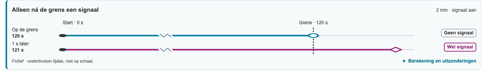
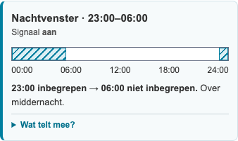
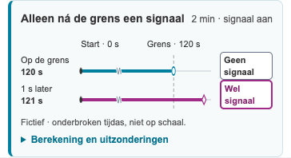
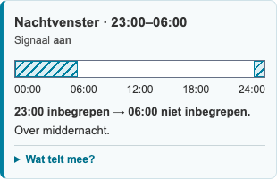
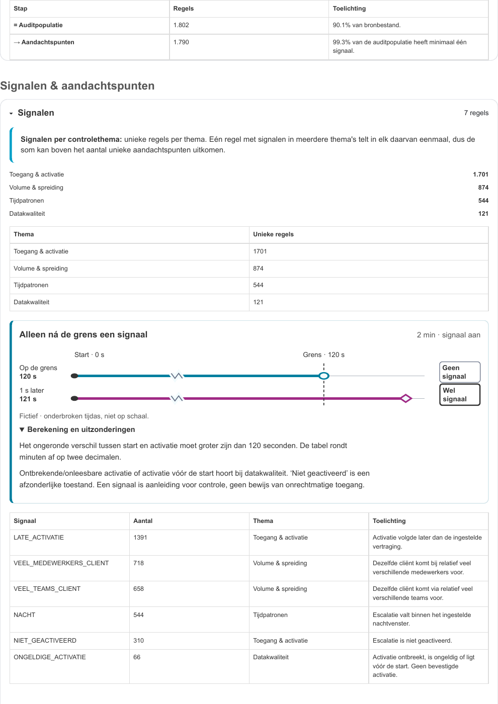
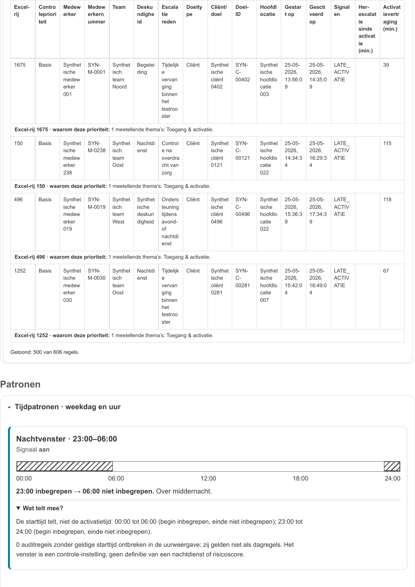
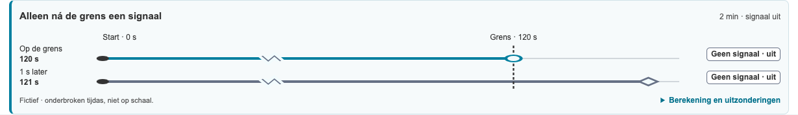
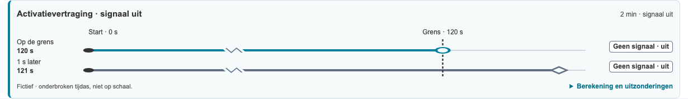

# Controle van activatievertraging en nachtvenster

Datum: 08-10-2026. Versie: 0.12.0. De twee [goedgekeurde ontwerpen](mockups/issue-17/README.md) zijn geïmplementeerd in de productie-webui en het HTML-rapport. Alle afgebeelde gegevens komen uit het standaard synthetische fixture; er zijn geen praktijkexports gebruikt.

## Uitvoering

- Eén gedeelde inhoudsbron: `analyze()` bewaart activatiegrens, voorbeeldseconden, signaaltoestand, geselecteerde nachtintervallen en ontbrekende starttijden. Beide uitvoervormen gebruiken dezelfde renderers.
- Activatie: onder de prioriteitsuitleg bij Aandachtspunten en binnen Signalen in het rapport. Twee fictieve tijdlijnen, gedeelde grens, cirkel tegenover ruit, exacte seconden en zichtbare asonderbreking. Bij grens nul vallen start en grens samen.
- Nacht: boven de bestaande uurweergave en binnen Tijdpatronen in het rapport. Gearceerde segmenten, vaste 24-uursas, begin inclusief/einde exclusief, leeg venster en afzonderlijke signaaltoestand.
- Berekening en uitzonderingen zitten in native uitklappers. De rapportuitleg blijft zonder JavaScript leesbaar en klapt samen met de betreffende rapportsectie in; `beforeprint` opent de uitklappers voor afdrukken.

## Gecontroleerd

De gerichte regressies in `tests/test_time_guidance.py` gebruiken echte genormaliseerde synthetische bronregels. Ze vergelijken de signaaltoekenning met de uitleg: 120/121 seconden, 0/1 seconde, uitgeschakelde late activatie, activatie vóór start, lege/onleesbare activatie en expliciet niet geactiveerd. Nachtgevallen controleren alle 24 starturen bij 23–6, 8–17 en 6–6, ontbrekende starttijd en nachtvolumes met uitgeschakeld signaal.

Heranalyse via de instellingen past beide visuals aan. Gewijzigde instellingen zonder heranalyse veranderen de uitleg van de bestaande analyse niet. De regressies controleren Enter-bediening, 1280/800/390 px zonder documentbrede of interne visual-overflow, gezamenlijk inklappen, printopening, PDF-generatie, statisch rapport zonder JavaScript en afwezigheid van JavaScriptfouten en HTTP(S)-requests.

Een afzonderlijke voor/na-controle op het standaardfixture vergelijkt de volledige signalentellingen, de prioriteit van elk aandachtspunt en de aandachtspunten-CSV byte voor byte met de vorige versie. Deze blijven gelijk. Referentiecijfers: 2000/156/42/1802 bron-/systeem-/duplicaat-/auditregels, 250 medewerkers, 558 cliënten, 40 locatiedoelen, 310 niet geactiveerd, 544 nacht, 1391 late activatie, 66 ongeldige activatie, 0 her-escalaties/zeer snel, 1790 aandachtspunten, 0 bursts en 5 cliëntclusters.

De screenshots op 390 en 1280 px, beide visuals in grijswaarden en de echte gepagineerde A4-afdruk zijn visueel beoordeeld. De afdrukbeelden hieronder komen van pagina 3 en 253 van het volledige synthetische rapport; de bestaande detailtabellen maken dat rapport lang. De nachtband blijft intact vóór de heatmap, die op de volgende pagina verdergaat. Dit is geen volledige toegankelijkheidsaudit of controle van iedere rapportpagina.

De volledige regressiesuite slaagt met **26 tests**. De coveragecontrole geeft **97,18% Python-testcoverage** (vereiste ondergrens 85%; geen JavaScript-coverage). Deze meting is uitgevoerd op macOS met Python 3.11.16. Coveragepercentages kunnen tussen testomgevingen verschillen doordat andere omgevingsafhankelijke codepaden worden uitgevoerd; leg daarom de omgeving en meetmethode bij het percentage vast. Locked dependency sync, mdformat, djLint, Ruff lint/format, Git-indexprivacycontrole, zes SVG-tekstgrenzen en `git diff --check` slagen.

## Webui

| Activatie op 390 px | Nachtvenster op 390 px |
| -- | -- |
|  |  |

## Werkelijke A4-afdruk

## Reviewafhandeling PR #30

De activatiekop vermeldt bij een uitgeschakeld signaal nu expliciet **Activatievertraging · signaal uit**, in beide uitvoervormen. De regressie controleert de kop bij signaal aan en uit, in het rapport en zonder JavaScript. De nachtvolume-opmerking is weerlegd: `analyze()` begint al met `state.settings={...s}`, vóór de aggregaties. De bestaande parametergevallen bewijzen 9 nachtregels bij 08–17 en 0 bij 06–06 zonder extra instellingensynchronisatie in de tests.

