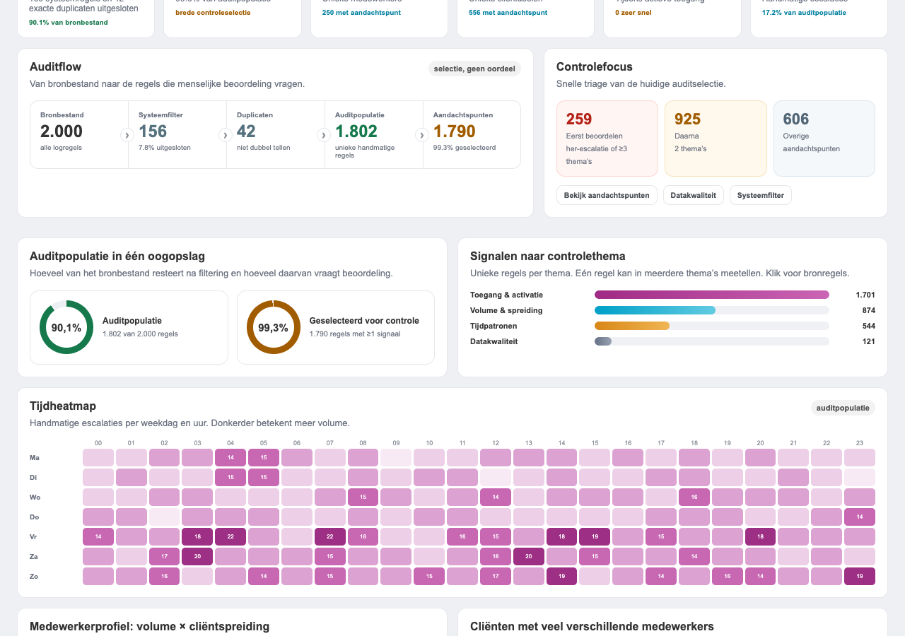
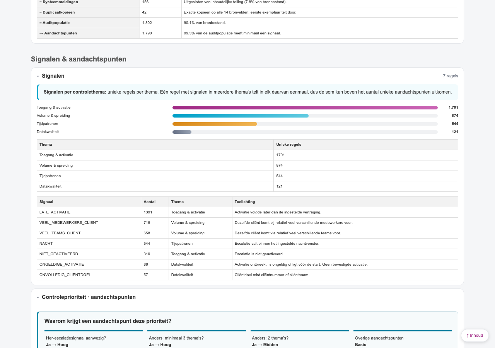
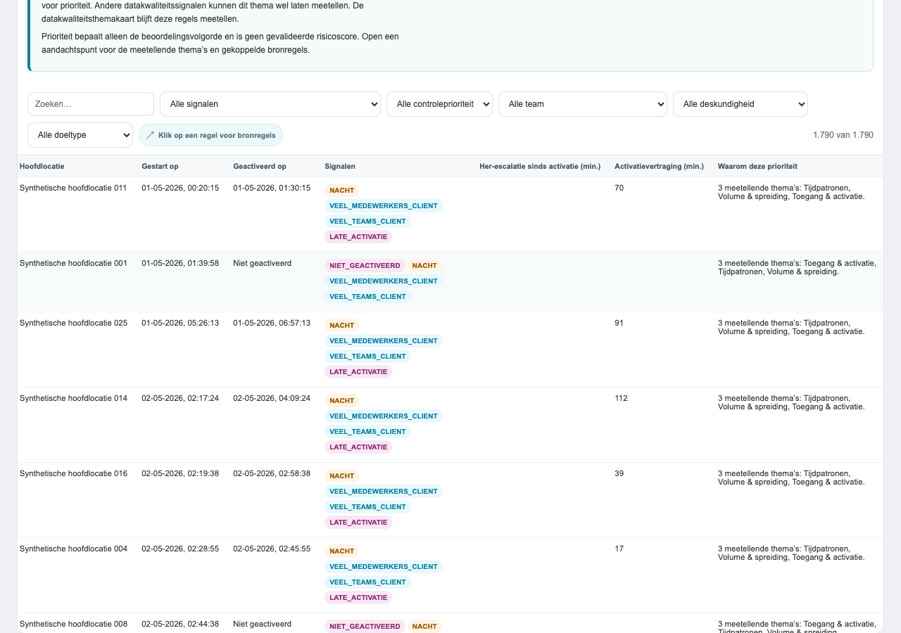
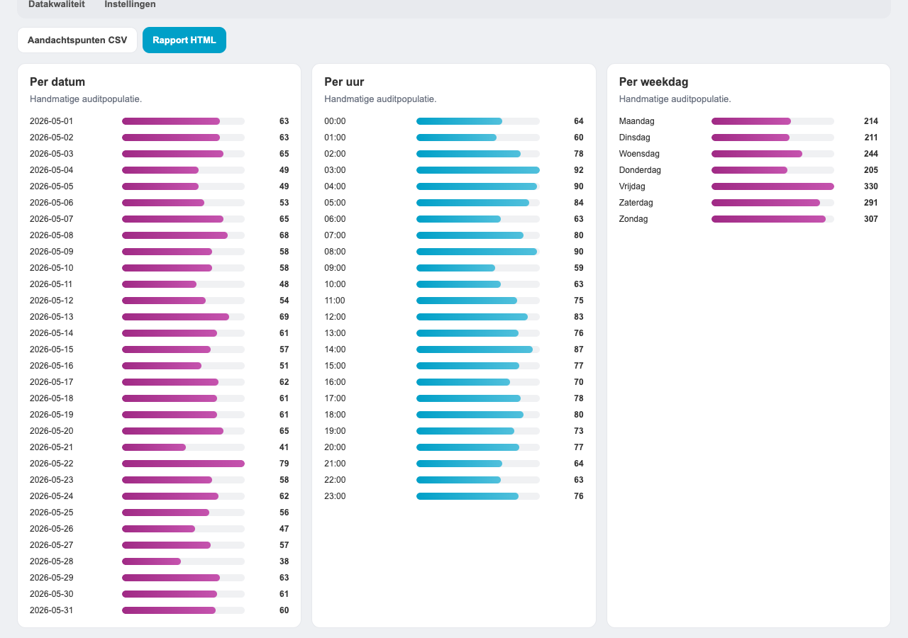
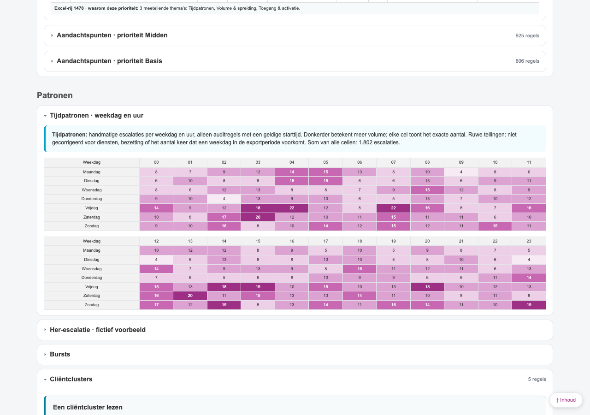
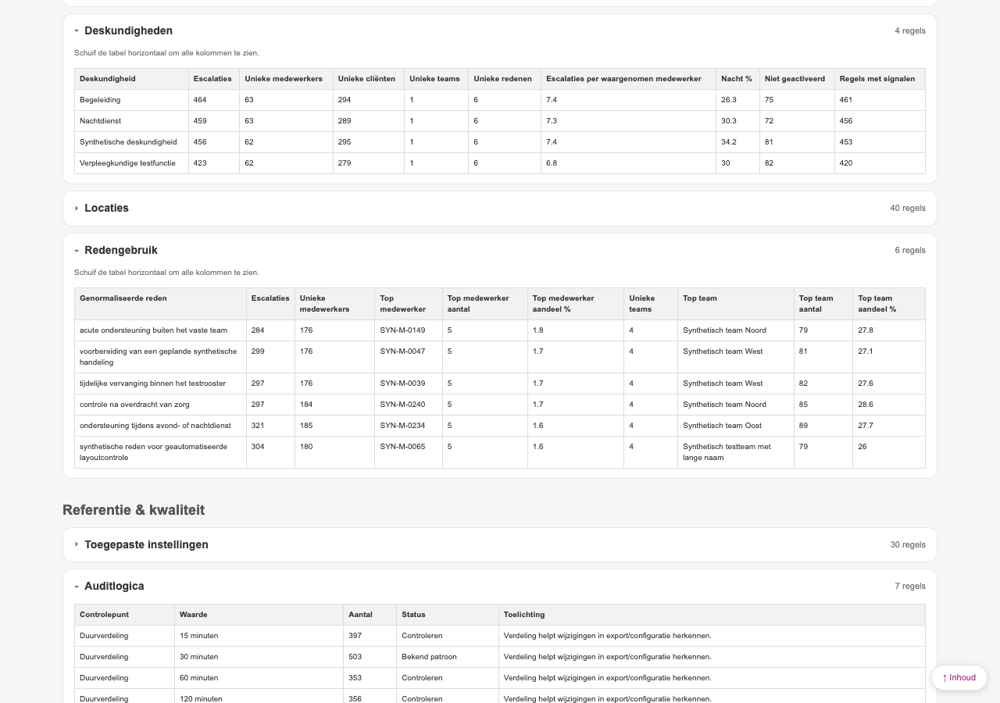
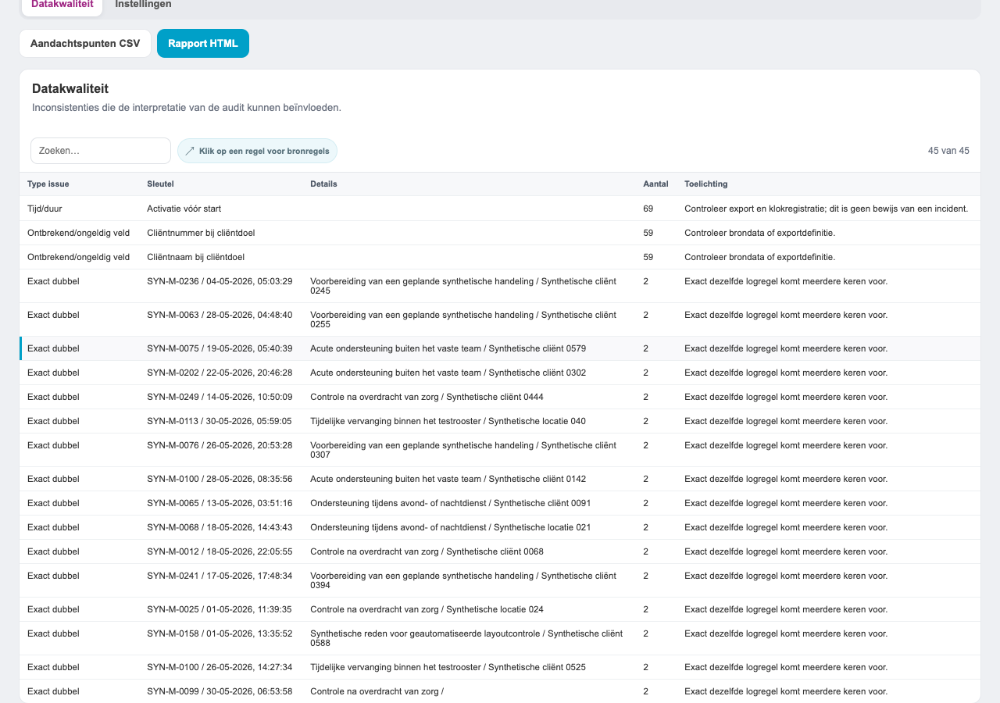
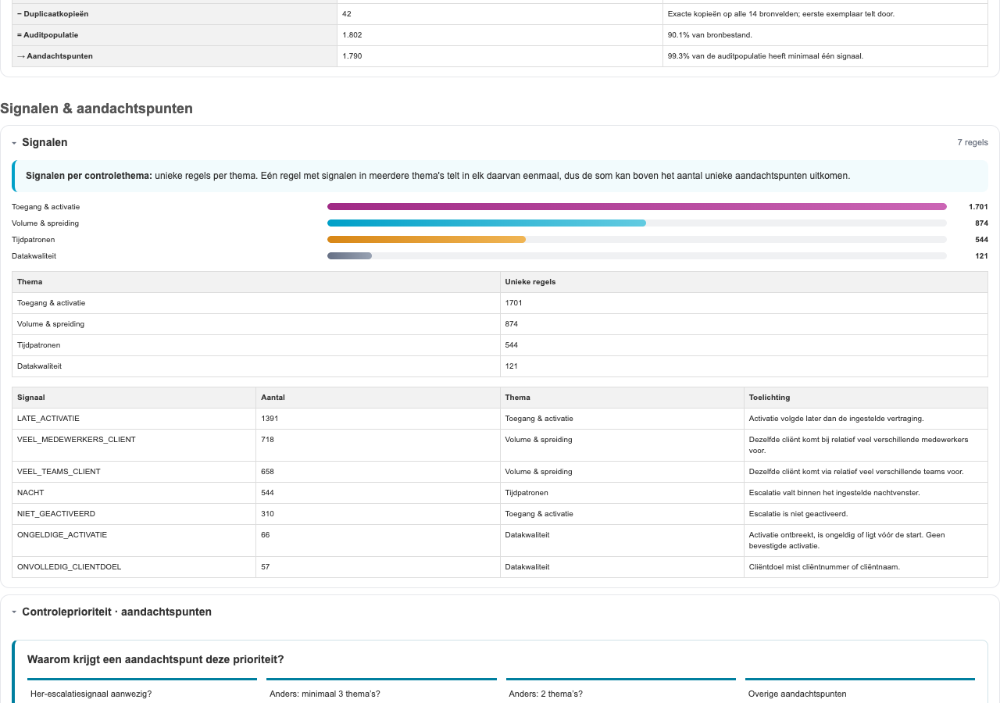

# Fase 2: beoordeling van compacte visuele uitleg

Beoordeling voor [issue #17](https://github.com/beecave-homelab/ons-escalatielog-audit/issues/17), uitgevoerd op 08-10-2026. De nulmeting gebruikt versie **0.11.1 op `main`**, commit `e13642f67a057d60186fcb4b9a5f32e64d8b3ade`, na de gemergede PR's [#8](https://github.com/beecave-homelab/ons-escalatielog-audit/pull/8) en [#14](https://github.com/beecave-homelab/ons-escalatielog-audit/pull/14). Import-PR #25 is na deze nulmeting gemergd. De nulmeting blijft gekoppeld aan bovenstaande commit; de importwijziging valt buiten deze beoordeling.

Dit document levert de nulmeting en besluiten op. **De gebruiker heeft op 08-10-2026 activatievertraging en het nachtvenster geselecteerd.** De [webui- en rapportmock-ups](mockups/issue-17/README.md) werken deze twee onderwerpen uit. De selectie en de compacte ontwerpen zijn op 08-10-2026 goedgekeurd; productie-implementatie volgt als afzonderlijke wijziging, volgens de werkvolgorde van [#2](https://github.com/beecave-homelab/ons-escalatielog-audit/issues/2).

## Nulmeting en bron

De invoer is uitsluitend het vastgelegde synthetische bestand `tests/fixtures/synthetic-escalatielog.xlsx` met 2.000 bronregels en seed `20260918`. De screenshots zijn nieuw gegenereerd uit de huidige webui en een nieuw geëxporteerd zelfstandig HTML-rapport, met standaardinstellingen. Zij bevatten fictieve medewerkers, cliënten en teams. De oorspronkelijke mock-ups van #2 zijn ontwerpgeschiedenis en zijn niet als nulmeting gebruikt.

De analyse geeft 156 systeemregels, 42 duplicaatkopieën, 1.802 auditregels en 1.790 unieke aandachtspunten. De reconciliatie blijft `2000 = 156 + 42 + 1802`. De 3.744 signaaltoekenningen en 3.240 thematellingen zijn geen aantallen unieke aandachtspunten:

| Controlethema | Unieke auditregels binnen het thema |
| -- | -: |
| Toegang en activatie | 1.701 |
| Volume en spreiding | 874 |
| Tijdpatronen | 544 |
| Datakwaliteit | 121 |

De themabalken tonen al exacte waarden en waarschuwen voor overlap. De webui koppelt een thema aan de bijbehorende bronregels; het rapport zet themabalken, thematabel en signaaltabel gezamenlijk binnen `#s-signalen`. De prioriteitsuitleg uit fase 1 maakt daarnaast onderscheid tussen thema's en losse signalen, inclusief de uitzondering voor niet-geactiveerde pogingen met een onvolledig cliëntdoel.

## Besluit per kandidaat

De afweging is: helpt de toevoeging een beheerder een concrete interpretatiefout te voorkomen, staat die uitleg al bij de uitkomst, en blijft de toevoeging compact in het zelfstandige rapport? Een ontbrekende visual is op zichzelf geen reden om er één toe te voegen. De besluiten gelden voor deze fase; uitstel betekent niet dat een kandidaat is geïmplementeerd of afgewezen.

| Kandidaat | Nulmeting: aanwezig en ontbrekend | Besluit | Controlewaarde en reden |
| -- | -- | -- | -- |
| Overlap signalen, thema's en aandachtspunten | Exacte thematellingen, waarschuwing voor overlap, unieke aandachtspunten en prioriteitsroute aanwezig in webui en rapport. Geen diagram met alle mogelijke combinaties. | **Niet opnemen** als extra visual | De bestaande uitleg behandelt het verschil tussen 3.744 signalen, 3.240 thematellingen en 1.790 aandachtspunten. Een extra diagram verdubbelt deze uitleg en kan combinaties ten onrechte als aparte populaties laten lezen. |
| Auditflow | Webui-flow en rapportpopulatietabel aanwezig; bronregels worden verdeeld in systeemregels, duplicaten en auditregels. | **Niet opnemen** als nieuwe uitwerking | Is al via #8 gerealiseerd. Behoud de bestaande reconciliatie en aandachtspunten als selectie binnen audit. |
| Activatievertraging op en net voorbij de grens | Aandachtspunten tonen afgeronde minuten; `LATE_ACTIVATIE` heeft een algemene omschrijving. De instelling en de precieze regel staan elders, zonder gezamenlijk grensvoorbeeld bij de uitkomst. | **Uitvoeren**, selectie akkoord | Het verschil tussen `>` en `≥` beïnvloedt welke regel een signaal krijgt. Een compact voorbeeld voorkomt dat een afgeronde minuutwaarde als beslisgrens wordt gelezen. |
| Nachtvenster als 24-uursband | Uurvolume en heatmap aanwezig, nachtinstellingen afzonderlijk zichtbaar. Geen band met begin inclusief, einde exclusief, overgang over middernacht of leeg venster bij gelijke uren. | **Uitvoeren**, selectie akkoord | Uurvolume verklaart niet welke uren de instelling selecteert. Vooral `23–6` en `6–6` vragen uitleg bij de tijdweergave. |
| Redenconcentratie: topmedewerker en topteam versus overige | `Redengebruik` heeft per reden aantallen en percentages, een contextwaarschuwing en bronregels; dezelfde aggregatie staat in het rapport. Geen part-to-whole-balk. | **Uitstellen** | De bestaande 11 kolommen bieden de exacte controle. De standaardfixture heeft slechts 1,6–1,8% voor de topmedewerker: een extra balk is daar weinig informatief. Eerst moet een mock-up aantonen dat een sterk geconcentreerde reden, een gelijkstand en een onbekende groep beter leesbaar worden zonder dubbele kolommen. Dit is niet de topredenenvisual uit #18. |
| Databalken bij percentagekolommen | Top-3-concentratie toont al teller, noemer, percentage, overige registraties en databalk in beide uitvoervormen. Andere percentages hebben exacte tekstwaarden. | **Niet opnemen** als algemene tabeldecoratie | Zonder eigen controlevraag kunnen bijvoorbeeld nachtpercentages als alarm- of risicoschaal worden gelezen. Een balk voor redenconcentratie hoort bij de afzonderlijk uitgestelde kandidaat. |
| Waarde naast drempel | Burst- en cliëntclustertabellen tonen al de relevante minima, vensterduur en selectiereden. Activatievertraging toont nog geen gezamenlijk grensvoorbeeld. | **Niet opnemen** als generieke tabelwijziging | Behoud de fase-1-uitwerking; behandel de ontbrekende activatiegrens bij de geselecteerde kandidaat. `17 / drempel 15` bij groepssignalen vraagt eerst een eigen context per dag, medewerker of cliënt, omdat niet iedere bronregel dezelfde soort teller heeft. |
| Ontbrekende peer-ratio's | `valueCellHtml()` verklaart lege ratio's als ontbrekende/wisselende context, onvoldoende peers of nulmediaan. Bestaande tests controleren alle drie; dezelfde celrenderer wordt in het rapport gebruikt. | **Niet opnemen** als nieuwe uitwerking | Reeds gerealiseerd in #14. Behoud de feitelijke reden en numerieke sortering; voeg geen generiek streepje of nulratio toe. |
| Groepering van datakwaliteit | Eén op `Aantal` gesorteerde tabel met type, sleutel, aantal, toelichting en gekoppelde bronregels. De fixture geeft 45 bevindingen in drie typen. Het rapport heeft dezelfde bevindingen. | **Uitstellen** | Groepering kan de grootste bevinding uit de gezamenlijke volgorde halen. De 45 bevindingen zijn geen 45 unieke probleemregels; type-totalen zijn evenmin optelbare unieke populaties. Eerst een ontwerp voor typefilters/groepen met zichtbare populatie en overlap, zonder extra inhoudelijke telling in de renderer. |

## Geselecteerde richting: activatievertraging

De te beantwoorden controlevraag is: **waarom krijgt een activatie exact op de ingestelde grens geen signaal, maar een activatie één seconde later wel?**

De berekening gebruikt auditregels met een leesbare start en activatie. De vergelijking gebeurt op het ongeronde verschil; de aandachtspuntentabel rondt minuten af op twee decimalen. In de gerichte synthetische controle:

| Start → activatie | Getoonde minuten | Grens | `LATE_ACTIVATIE` |
| -- | -: | -: | -- |
| 120 seconden | 2 | 2 minuten | Nee |
| 121 seconden | 2,02 | 2 minuten | Ja |
| −1 seconde | −0,02 | 2 minuten | Nee; wel `ONGELDIGE_ACTIVATIE` |
| 0 seconden | 0 | 0 minuten | Nee |
| 1 seconde | 0,02 | 0 minuten | Ja |

Voor de geselecteerde mock-up: ontwerp twee tijdlijnen met een gedeelde grensmarkering en twee expliciet fictieve voorbeelden, `op de grens: geen laat-activatiesignaal` en `één seconde erover: wel`, met de toegepaste instelling en de toestand van de signaalschakelaar. Bij een uitgeschakeld signaal beschrijft het voorbeeld uitsluitend de tijdsvergelijking en vermeldt het dat het signaal uitstaat. Een ontbrekende/onleesbare activatie en activatie vóór de start horen bij datakwaliteit; `Niet geactiveerd` is een afzonderlijke geregistreerde toestand.

Plaats het algemene voorbeeld bij **Aandachtspunten**, onder de prioriteitsuitleg en vóór de tabel. In het rapport hoort het bij de bestaande **Signalen**-sectie `#s-signalen`, vóór de signaaltabel, zodat voorbeeld, omschrijving en telling samen inklappen. Een eventueel werkelijk rijvoorbeeld in de webui toont beide brontijden en de exacte seconden naast de ingestelde grens; het rapportvoorbeeld blijft fictief en mag geen individuele bronregel suggereren.

Het gedeelde model bevat de toegepaste drempel, signaalschakelaar, voorbeeldseconden en grensuitkomst. Een renderer maakt geen nieuwe bevindingen. Bij echte bronregels moet `analyze()` eventuele extra uitleggegevens aanmaken; de bestaande signaaltoekenning en CSV-schema's veranderen niet. Alle bronwaarden worden met `esc()` weergegeven.

## Geselecteerde richting: nachtvenster

De te beantwoorden controlevraag is: **welke starturen vallen in mijn ingestelde nachtvenster?** De selectie gebruikt het startuur van auditregels met een geldige starttijd, niet de activatietijd. Nachtvolumes blijven beschikbaar als de signaalschakelaar uitstaat; dat is niet hetzelfde als het aantal regels met het signaal `NACHT`.

De gerichte synthetische controle bevestigt:

| Instelling | Binnen | Buiten | Betekenis |
| -- | -- | -- | -- |
| 23:00–06:00 | 23, 0 en 5 uur | 22 en 6 uur | Over middernacht; begin inclusief, einde exclusief |
| 08:00–17:00 | 8 en 16 uur | 7 en 17 uur | Venster binnen dezelfde dag |
| 06:00–06:00 | Geen enkel van de 24 uren | Alle uren | Leeg venster, niet een etmaal |

Voor de geselecteerde mock-up: ontwerp één 24-uursband op de vaste as **00:00–24:00**, met de huidige ingestelde begin- en eindtijd als tekst. Voor `23–6` verschijnen twee segmenten, `00:00–06:00` en `23:00–24:00`, met daarnaast de tekst `begin inbegrepen, einde niet inbegrepen`. Bij gelijke uren staat expliciet `leeg nachtvenster`, met geen gevuld segment. Een instelling die overdag valt blijft dezelfde definitie gebruiken; noem deze instelling geen objectieve definitie van een nachtdienst.

Plaats de band bij **Tijdpatroon**, boven de bestaande uurweergave, en in het rapport binnen **Tijdpatronen** `#s-tijd`, boven de heatmap. Gebruik één gedeeld model op basis van de toegepaste analyse-instellingen en dezelfde `isNight()`-semantiek. Toon de aan/uit-toestand van `signalNight` afzonderlijk. De band is instellingenuitleg en berekent geen extra nachtbevindingen. Ontbrekende starttijden blijven afzonderlijk vermeld en worden niet als dagregels gepresenteerd.

## Uitgestelde kandidaten: voorwaarden voor heroverweging

**Redenconcentratie:** gebruik uitsluitend `reasonUse`, met dezelfde minimumselectie als de tabel (`reasonConcentrationMinCount`, standaard 3). Per genormaliseerde reden zijn er twee verschillende aandelen: topmedewerker en topteam, ieder gedeeld door alle auditregels met die reden. Gebruik de al beschikbare gehele tellers voor `overige = totaal − top`; reconstrueer geen aantallen uit afgeronde percentages. Bij een gelijkstand blijft de bestaande eerste waargenomen groep staan. Een ontbrekende medewerkerssleutel of team kan als onbekende groep de top vormen en mag niet als één geïdentificeerde persoon/team worden gelabeld. Een toekomstig ontwerp moet 0/100%, een gelijkstand, een onbekende groep en een sterk geconcentreerde reden tonen. Plaats een gekozen visual samen met de volledige tabel binnen `#s-redengebruik`. Geen vermenging met top-3-doelconcentratie of de volledige redenaggregatie van #18.

**Datakwaliteit:** gebruik `manualRows`, inclusief duplicaten; de auditpopulatie en datakwaliteitsthemakaart zijn andere populaties. De fixture heeft 69 regels met activatie vóór start in datakwaliteit, tegenover 66 auditregels met `ONGELDIGE_ACTIVATIE`. Dat verschil volgt uit de populatie en is geen fout die een visual moet wegpoetsen. Een ontwerp moet de populatie, het aantal bevindingen en het aantal bronregels uit elkaar houden, de bestaande doorklikselectie behouden en overlap niet optellen tot een uniek totaal. Webui-groepen mogen zoeken en sorteren niet onduidelijk maken. Een eventuele uitvoering hoort bij Datakwaliteit en binnen `#s-datakwaliteit` in het rapport.

## Acceptatie voor een latere implementatie

De gebruikersselectie is afgerond; de compacte webui- en exportmock-ups zijn op 08-10-2026 goedgekeurd. Voor een productie-uitwerking gelden deze controles:

- Eén gedeelde inhoudsbron met de daadwerkelijk toegepaste instellingen; heranalyse en gewijzigde signaalschakelaars mogen geen oude uitleg laten staan.
- Activatie: op de grens en één seconde erboven, drempel nul, uitgeschakeld signaal, negatieve/ongeldige/ontbrekende activatie en expliciet niet geactiveerd. De vergelijking blijft ongerond en strikt `>`.
- Nacht: venster over middernacht, venster binnen één dag, begin inclusief, einde exclusief, gelijke uren, ontbrekende start en uitgeschakeld signaal met behouden nachtvolumes.
- Exacte tekstwaarden en betekenis blijven beschikbaar zonder kleur; geen animatie of risicoschaal. Decoratieve banddelen zijn verborgen voor hulptechnologie. Eventuele SVG's krijgen een unieke titel en beschrijving.
- Controleer toetsenbordbediening, 1280, 800 en 390 px, grijswaarden en echte printuitvoer. Voorkom documentbrede overflow; brede tabellen behouden hun scrollcontainer.
- In het rapport klappen uitleg en relevante tabel gezamenlijk in. `beforeprint` opent alle secties; teksten en grensmarkeringen moeten in de afdruk leesbaar blijven.
- Dezelfde synthetische referentiecijfers, signalen, prioriteiten, reconciliatie en CSV-schema's. Geen netwerk, browseropslag, externe assets of versoepelde CSP.
- Werk bij productie-uitvoering de functionele documentatie, README, SemVer, changelog en lockfile samen bij. Voeg synthetisch voor/na-bewijs aan de betreffende visuele PR toe.

## Controlebewijs en grenzen

De meetwaarden en gerichte grenscontroles staan in [qa.json](assets/fase-2-nulmeting/qa.json), inclusief de commit en SHA-256 van het fixture. De activatiegevallen gebruiken `normalizeRows()` en `analyze()` met drie afzonderlijke fictieve medewerkers/cliënten en starttijd `01-01-2026, 08:00:00`; de activaties liggen 120, 121 en −1 seconde later. De nulgrens gebruikt 0 en 1 seconde. De uurgevallen roepen `isNight()` rechtstreeks aan met de uren uit de tabel; bij gelijke uren zijn alle 24 uren gecontroleerd. De nieuwe export is 1.277.846 bytes. De webui en het rapport zijn op 1280, 800 en 390 px op documentbrede overflow gecontroleerd. Het `beforeprint`-event opent alle rapportsecties. Er zijn geen ongehanteerde JavaScriptfouten (`pageerror`) of HTTP(S)-requests waargenomen tijdens de nulmeting. De volledige bestaande suite slaagt met **10 tests en 96,04% Python-coverage** (ondergrens 85%). De Markdown-, djLint-, Ruff-, privacy- en SVG-tekstcontroles zijn eveneens uitgevoerd; dit bewijst de bestaande werking, niet de nog te ontwerpen visuals.

De screenshots tonen de bestaande uitvoer, geen mock-ups of voor/na-bewijs van een nieuwe visual. De printmedia-screenshot controleert geen volledige gepagineerde PDF of grijswaardenafdruk. De mobiele controle bewijst containment, niet dat iedere tabelkolom tegelijk leesbaar is. Die bredere controles horen bij de latere geselecteerde implementatie.

De nulmeting omvat het standaardfixture en gerichte activatie- en nachtgrenzen. De lage topmedewerkeraandelen uit het fixture zijn geen bewijs dat redenconcentratie in praktijkbestanden nooit nuttig is. Daarom blijft die kandidaat uitgesteld voor gerichte ontwerpvalidatie.
